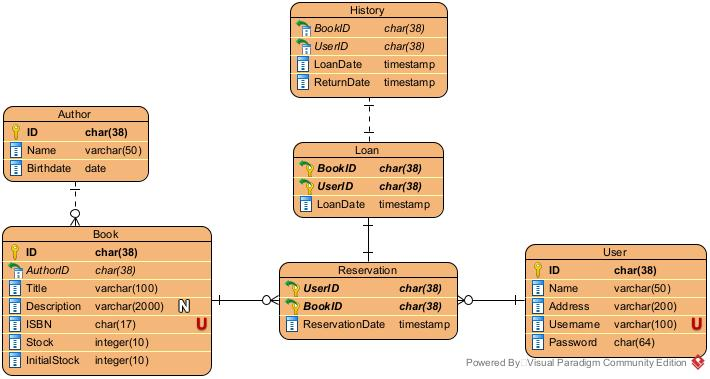

# Introduction to DBSigmaRizz
This is a repository to store and document the process and results of creating a library database system from an unnormalized dataset file.

[unnormalized library data](unnormalized_library_data(in).csv)

# Setup
This project uses **XAMPP** as the web server for its easy setup, cross-platform support and easily usable interface to manage the built-in MySQL (MariaDB) database system. XAMPP is ideal for testing web development as it provides an isolated thus safe web application development environment, in case the projec is to be extended into a web application.

# Database Design
The ERD for the library system is createdusing the free **Visual Paradigm Community Edition**.

