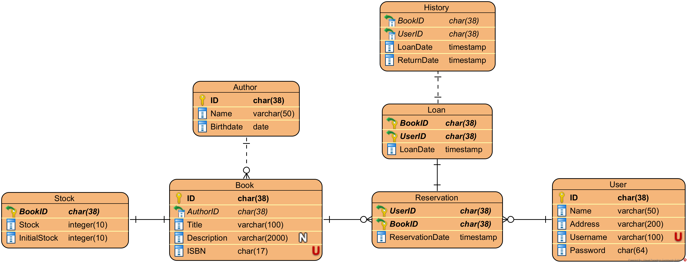

# Library Management System - Road to Sigma Rizz DBA, for B27 database technology CS GC.
This is a repository to store and document the process and results of creating a library database system from an unnormalized dataset file. This project is developed as part of the B26 Database Technology course. It involves designing and implementing a comprehensive database management system (DBMS) for a library. The system covers all core aspects of DBMS, from storage management and memory optimization to transactions, indexing, and security.

## Table of Contents
- [Resources](#resources)
- [Normalization](#Normalization)
- [Setup](#setup)
- [Entity Relationship Diagram](#entity-relationship-diagram)
- [Entities and Relationships](#entities-and-relationships)
- [Indexing](#indexing)
- [Storage Management](#storage-management)
- [Transactions and Procedures](#transactions-and-procedures)
- [Triggers](#triggers)
- [Roles and Permissions](#roles-and-permissions)
- [SSL Security Protocol](#ssl-security-protocol)
- [Backup and Restore](#backup-and-restore)


## Resources
- [Unnormalized Library Data](data/unnormalized_library_data(in).csv)

## Normalization
|   Book_ID | Title                       | Author_Name      | Author_Birthdate   | ISBN              |   User_ID | User_Name           | User_Address                                               | Loan_Date   | Return_Date   |
|----------:|:----------------------------|:-----------------|:-------------------|-------------------|----------:|:--------------------|:-----------------------------------------------------------|:------------|:--------------|
|      3115 | Particularly charge nearly. | Anita Walker     | 11/1/1962          | 978-1-4223-8315-5 |      8425 | Tracey Kelly        | PSC 6481, Box 1952, APO AA 89825                           | 4/9/2024    | 8/21/2024     |
|      3270 | Goal ability him.           | Joseph Alvarez   | 1/5/1965           | 978-1-235-83555-1 |      9366 | Brittany Kim DVM    | 80826 Miller Plaza, Shariton, PR 87489                     | 2/14/2024   | 8/5/2024      |
|      3862 | Board.                      | Kimberly Brown   | 8/3/1970           | 978-0-483-52991-5 |      4425 | Daniel Harrison DDS | 95457 Christopher Manor Suite 485, Port Samantha, MT 79549 | 5/1/2024    | 7/31/2024     |
|      5157 | Remain begin.               | Christian Mason  | 1/18/1954          | 978-1-924983-22-8 |      8425 | Tracey Kelly        | PSC 6481, Box 1952, APO AA 89825                           | 2/3/2024    | 7/17/2024     |
|      6607 | Catch form kitchen.         | Calvin Clark     | 2/5/1984           | 978-0-01-444353-6 |      6304 | Erica Davidson      | 51540 Barbara Brook, Andrewmouth, DC 89545                 | 4/15/2024   | 8/31/2024     |
|      5011 | Dinner ahead but.           | Michael Morrison | 10/25/1988         | 978-1-298-44863-7 |      8425 | Tracey Kelly        | PSC 6481, Box 1952, APO AA 89825                           | 8/23/2024   | 9/8/2024      |

The [dataset](data/unnormalized_library_data(in).csv) given is unnormalized, meaning it has a lot of data redundancy. There are several steps to normalize this database.

### 1. Identify Repeating Data
It can be seen that the `Title`, `Author_Name`, `Author_Birthdate`, `ISBN`, `User_Name`, and `User_Address` are repeating and space-taking. They can then be separated into several entities, which are `Book`, `Author`, `User`, and `Loan History`.

### 2. ID Systems
Currently, the `Author` table does not have any ID system and `Book_ID` and `User_ID` are indistinguishable from one another. Hence the usage of `UUID` system, which is already by itself universally unique, concatenated with a prefix with each table's alias (e.g., "A-c350a9cd-8eed-11ef-834d-08bfb82c14c5" for `Author_ID`). This method is used over `AUTO_INCREMENT` because of its fixed-length string result and untraceability.

### Result
The normalization process results in a [Normalized Library Data](data/normalized_library_data.xlsx).

## Setup

### Web Server
This project uses [XAMPP](https://www.apachefriends.org/index.html) as the web server for its easy setup, cross-platform support and easily usable interface to manage the built-in MySQL (MariaDB) database system. XAMPP is ideal for testing web development as it provides an isolated thus safe web application development environment, in case the projec is to be extended into a web application.

To start the MySQL (MariaDB) database service, open the `XAMPP Control Panel` and start both the `Apache` and `MySQL` Module, and click on `Admin` next to `MySQL`.


### Storage Engine
`XAMPP` provides a range of storage engine to choose:

| Storage Engine     | Description                                                                                      |
|:-------------------|:-------------------------------------------------------------------------------------------------|
| CSV                |	Stores tables as CSV files                                                                      |
| MRG_MyISAM         |	Collection of identical MyISAM tables                                                           |
| MEMORY             |	Hash based, stored in memory, useful for temporary tables                                       |
| Aria               |	Crash-safe tables with MyISAM heritage. Used for internal temporary tables and privilege tables |
| MyISAM             |	Non-transactional engine with good performance and small data footprint                         |
| SEQUENCE           |	Generated tables filled with sequential values                                                  |
| InnoDB             |	Supports transactions, row-level locking, foreign keys and encryption for tables                |
| PERFORMANCE_SCHEMA |	Performance Schema                                                                              |

From these choices, `InnoDB` should be used for the library data tables, as it provides the most features which are essential for the database.

## Entity Relationship Diagram

This ERD represents the schema for a Library Management System designed to manage books, users, loans, reservations, and author information.

## Entities and Relationships

### 1. Author
- **Attributes**:
  - `ID` (Primary Key): Unique identifier for each author.
  - `Name`: The name of the author. Added `FULLTEXT` support for faster searching.
  - `Birthdate`: The date of birth of the author.
- **Script**:
  ```sql
  CREATE TABLE
  Author (
    ID CHAR(38) PRIMARY KEY DEFAULT CONCAT ('A-', UUID ()),
    Name VARCHAR(50) NOT NULL,
    CHECK (Name != ''),
    Birthdate DATE NOT NULL,
    CHECK (Birthdate > '0000-00-00'),
    UNIQUE (Name, Birthdate),
    FULLTEXT (Name)
  ) ENGINE = InnoDB;
  ```
- **Relationships**:
  - Each `Author` can write multiple `Books`.

### 2. Book
- **Attributes**:
  - `ID` (Primary Key): Unique identifier for each book.
  - `AuthorID` (Foreign Key): Refers to the `ID` of the `Author`.
  - `Title`: The title of the book. Added `FULLTEXT` support for faster searching.
  - `Description`: A brief description of the book. Added `FULLTEXT` support for faster searching.
  - `ISBN`: Unique identifier for the book's edition.
- **Script**:
  ```sql
  CREATE TABLE
  Book (
    ID CHAR(38) PRIMARY KEY DEFAULT CONCAT ('B-', UUID ()),
    AuthorID CHAR(38) NOT NULL,
    CHECK (AuthorID != ''),
    Title VARCHAR(100) NOT NULL,
    CHECK (Title != ''),
    Description VARCHAR(2000) NULL,
    CHECK (Description != ''),
    ISBN CHAR(17) NOT NULL UNIQUE,
    CHECK (ISBN REGEXP '^(978|979)-[0-9]{1,5}-[0-9]{1,7}-[0-9]{1,7}-[0-9]$'),
    FOREIGN KEY (AuthorID) REFERENCES Author (ID)
      ON UPDATE CASCADE 
      ON DELETE RESTRICT,
  FULLTEXT (Title, Description)
  ) ENGINE = InnoDB;
  ```
- **Relationships**:
  - Each `Book` is associated with one `Author`.
  - Each `Book` is extended by one `Stock` table.
  - Each `Book` can have multiple `Loans` and `Reservations`.
 
### 3. Stock
- **Attributes**:
  - `BookID` (Foreign Key): Refers to the `ID` of the `Book`.
  - `Stock`: The current number of available copies.
  - `InitialStock`: The original number of copies added to the library.
- **Script**:
  ```sql
  CREATE TABLE
    Stock (
      BookID CHAR(38) PRIMARY KEY,
      Stock INTEGER (10) NOT NULL,
      CHECK (Stock >= 0 AND Stock <= InitialStock),
      InitialStock INTEGER (10) NOT NULL,
      FOREIGN KEY (BookID) REFERENCES Book(ID)
      ON UPDATE CASCADE
      ON DELETE CASCADE
    ) ENGINE = InnoDB;
  ```
- **Relationships**:
  - Each `Stock` extends `Book` for a more efficient `Stock` value updating.
    
### 4. DeletedBook
- **Attributes**:
  - `ID` (Primary Key): Unique identifier for each deleted book.
  - `AuthorID` (Foreign Key): Refers to the `ID` of the `Author`.
  - `Title`: The title of the deleted book.
  - `Description`: A brief description of the deleted book.
  - `ISBN`: Unique identifier for the deleted book's edition.
- **Script**:
  ```sql
  CREATE TABLE
  DeletedBook (
    ID CHAR(38) PRIMARY KEY,
    AuthorID CHAR(38) NULL,
    CHECK (AuthorID != ''),
    Title VARCHAR(100) NOT NULL,
    CHECK (Title != ''),
    Description VARCHAR(2000) NULL,
    CHECK (Description != ''),
    ISBN CHAR(17) NOT NULL UNIQUE,
    CHECK (ISBN REGEXP '^(978|979)-[0-9]{1,5}-[0-9]{1,7}-[0-9]{1,7}-[0-9]$'),
    FOREIGN KEY (AuthorID) REFERENCES Author (ID)
      ON UPDATE CASCADE 
      ON DELETE RESTRICT
  ) ENGINE = InnoDB;
  ```
- **Relationships**:
  - Each `DeletedBook` acts as a place for deleted `Book` rows to preserve their information while not being available for loan.

### 5. User
- **Attributes**:
  - `ID` (Primary Key): Unique identifier for each user.
  - `Name`: The name of the user.
  - `Address`: The address of the user.
  - `Username`: Unique username for user login.
  - `Password`: Encrypted password for user authentication.
```sql
CREATE TABLE
  `User` (
    ID CHAR(38) PRIMARY KEY DEFAULT CONCAT ('U-', UUID ()),
    Username VARCHAR(100) NOT NULL UNIQUE,
    CHECK (Username != ''),
    Name VARCHAR(50) NOT NULL,
    CHECK (Name != ''),
    Address VARCHAR(200) NOT NULL,
    CHECK (Address != ''),
    `Password` CHAR(64) NOT NULL,
    CHECK (CHAR_LENGTH(`Password`) = 64)
  ) ENGINE = InnoDB;
  ```
- **Relationships**:
  - Each `User` can borrow multiple `Books` (via `Loan`).
  - Each `User` can reserve multiple `Books` (via `Reservation`).

### 6. Reservation
- **Attributes**:
  - `BookID` (Foreign Key): Refers to the `ID` of the `Book`.
  - `UserID` (Foreign Key): Refers to the `ID` of the `User`.
  - `ReservationDate`: The date when the reservation was made.
- **Script**:
  ```sql
  CREATE TABLE
  Reservation (
    BookID CHAR(38) NOT NULL,
    UserID CHAR(38) NOT NULL,
    ReservationDate TIMESTAMP NOT NULL DEFAULT CURRENT_TIMESTAMP,
    PRIMARY KEY (BookID, UserID),
    FOREIGN KEY (UserID) REFERENCES `User` (ID)
      ON UPDATE CASCADE 
      ON DELETE CASCADE,
    FOREIGN KEY (BookID) REFERENCES Book (ID) 
      ON UPDATE CASCADE 
      ON DELETE CASCADE
  ) ENGINE = InnoDB;
  ```
- **Relationships**:
  - A `Reservation` links a `User` to a `Book`. It represents a reserved copy that will be borrowed when available.

### 7. Loan
- **Attributes**:
  - `BookID` (Foreign Key): Refers to the `ID` of the `Book`.
  - `UserID` (Foreign Key): Refers to the `ID` of the `User`.
  - `LoanDate`: The date when the book was borrowed.
- **Script**:
  ```sql
  CREATE TABLE
  Loan (
    BookID CHAR(38) NOT NULL,
    UserID CHAR(38) NOT NULL,
    LoanDate TIMESTAMP NOT NULL DEFAULT CURRENT_TIMESTAMP,
    CHECK (LoanDate > '0000-00-00 00-00-00'),
    PRIMARY KEY (BookID, UserID, LoanDate),
    FOREIGN KEY (UserID) REFERENCES `User` (ID) 
      ON UPDATE CASCADE 
      ON DELETE RESTRICT,
    FOREIGN KEY (BookID) REFERENCES Book (ID) 
      ON UPDATE CASCADE 
      ON DELETE RESTRICT
  ) ENGINE = InnoDB;
  ```
- **Relationships**:
  - A `Loan` connects a `User` to a `Book`. Each loan represents a book that is currently borrowed.

### 8. History
- **Attributes**:
  - `BookID` (Foreign Key): Refers to the `ID` of the `Book`.
  - `UserID` (Foreign Key): Refers to the `ID` of the `User`.
  - `DeletedBookID` (Foreign Key): Refers to the `ID` of the `DeletedBook`.
  - `LoanDate`: The date when the book was borrowed.
  - `ReturnDate`: The date when the book was returned.
- **Script**:
  ```sql
  CREATE TABLE
  History (
    BookID CHAR(38) NULL,
    UserID CHAR(38) NOT NULL,
    DeletedBookID CHAR(38) NULL,
    LoanDate TIMESTAMP NOT NULL,
    CHECK (LoanDate > '0000-00-00 00-00-00'),
    ReturnDate TIMESTAMP NOT NULL DEFAULT CURRENT_TIMESTAMP,
    CHECK (ReturnDate > '0000-00-00 00-00-00'),
    FOREIGN KEY (BookID) REFERENCES Book (ID)
      ON UPDATE CASCADE
      ON DELETE SET NULL,
    FOREIGN KEY (UserID) REFERENCES `User` (ID) 
      ON UPDATE CASCADE
      ON DELETE CASCADE,
    FOREIGN KEY (DeletedBookID) REFERENCES DeletedBook (ID)
      ON UPDATE CASCADE
      ON DELETE SET NULL
  ) ENGINE = InnoDB;
  ```
- **Relationships**:
  - The `History` entity logs past loans, showing which `User` borrowed which `Book`, and when.

## Indexing
For a **faster** and more **efficient** data retrieval when querying, columns which are checked using `WHERE` statements (or any that could be used for searching purposes) are `INDEX`ed at the cost of slower `INSERT` and `UPDATE`.

- **Author**:
  ```sql
  CREATE INDEX idx_authorid ON Author (ID);
  ```
  - `idx_authorid`: For faster querying of author information by `ID`. (e.g., Displaying author's `Name` and `Birthdate` when opening a book).
- **Book**:
  ```sql
  CREATE INDEX idx_bookid ON Book (ID);
  CREATE INDEX idx_bookauthorid ON Book (AuthorID);
  CREATE INDEX idx_bookisbn ON Book (ISBN);
  ```
  - `idx_bookid`: Allows faster retrieval of book data from a `Reservation` or `Loan`.
  - `idx_bookauthorid`: Useful for when looking up books written by a specific author by `ID`.
  - `idx_bookisbn`: Speeds up searching for books from its `ISBN`, unique identifiers ofen used for searching or verifying book details.
- **Stock**:
  ```sql
  CREATE INDEX idx_stock ON Stock(Stock);
  ```
  - `idx_stock`: Allows faster querying of books sorted by availability (whether stock exists).
- **DeletedBook**
  ```sql
  CREATE INDEX idx_deletedisbn ON DeletedBook (ISBN);
  ```
  - `idx_deletedisbn`: For faster checking when inserting a new `Book`. If there is a `DeletedBook` with the same `ISBN` of the new `Book`, restore the `DeletedBook` instead. 
- **User**:
  ```sql
  CREATE INDEX idx_userid ON `User` (ID);
  CREATE INDEX idx_username ON `User` (Username);
  ```
  - `idx_userid`: Similar to `idx_bookid`.
  - `idx_username`: Speeds up searches by `Username`, which is helpful for user authentication and profile lookup.
- **Reservation**:
  ```sql
  CREATE INDEX idx_reservationid ON Reservation (BookID, UserID);
  CREATE INDEX idx_bookreservationbydate ON Reservation (BookID, ReservationDate);
  CREATE INDEX idx_userreservationbydate ON Reservation (UserID, ReservationDate);
  ```
  - `idx_reservationid`: A composite index on `BookID` and `UserID` for a more specific searching of reservations where a user has reserved a particular book.
  - `idx_bookreservationdate`: Used to list reservations for a specific `Book`, and could be used to find the oldest `Reservation` created for a specific `Book` for creating `Loan`.
  - `idx_userreservationdate`: Used to list `Reservation`s done by a user sorted by date.
- **Loan**:
  ```sql
  CREATE INDEX idx_loanid ON Loan (BookID, UserID);
  CREATE INDEX idx_bookloanbydate ON Loan (BookID, LoanDate);
  CREATE INDEX idx_userloanbydate ON Loan (UserID, LoanDate);
  ```
  - `idx_loanid`: Similar to `idx_reservationid`.
  - `idx_bookloandate`: Similar to `idx_bookreservationdate`.
  - `idx_userloandate`: Similar to `idx_userreservationdate`.
- **History**:
  ```sql
  CREATE INDEX idx_returnbookid ON History (BookID);
  CREATE INDEX idx_historybydate ON History (LoanDate);
  CREATE INDEX idx_bookreturnbydate ON History (BookID, LoanDate);
  CREATE INDEX idx_userreturnbydate ON History (UserID, LoanDate);
  CREATE INDEX idx_bookidbydate ON History (BookID, UserID, LoanDate);
  ```
  - `idx_returnbookid`: For faster querying to update `DeletedBookID` of `History` when a `Book` is deleted.
  - `idx_historybydate`: Used for faster sorting of the `History` of returned `Book`s as a whole.
  - `idx_bookreturnbydate`: Used for listing the `History` of returned `Loan`s for a specific `Book` sorted by `LoanDate`.
  - `idx_userreturnbydate`: Used for `User`s to view their past `Loan`s sorted by `LoanDate`.
  - `idx_returnidbydate`: Used for specifically recall past `Loan`s of a certain `Book` by a certain `User` sorted by `LoanDate`.
 
## Storage Management
By default, `InnoDB` already separates tables into their own respective files.
```plaintext
xampp/
└── mysql/
    └── data/
        └── library/
            ├── author.frm
            ├── author.ibd
            ├── book.frm
            ├── book.ibd
            ├── deletedbook.frm
            ├── deletedbook.ibd
            ├── history.frm
            ├── history.ibd
            ├── loan.frm
            ├── loan.ibd
            ├── reservation.frm
            ├── reservation.ibd
            ├── user.frm
            └── user.ibd
```
### Modifying XAMPP MySQL
To change the default sizes of each table, configure the `my.ini` file located in `.../xampp/mysql/bin`. The values can be modified according to need.
```ini
[mysqld]
...
# Comment the following if you are using InnoDB tables
#skip-innodb
innodb_file_per_table=1
innodb_data_home_dir=".../xampp/mysql/data"
innodb_data_file_path=ibdata1:10M:autoextend
innodb_autoextend_increment=20M
innodb_log_group_home_dir=".../xampp/mysql/data"
#innodb_log_arch_dir = ".../xampp/mysql/data"
## You can set .._buffer_pool_size up to 50 - 80 %
## of RAM but beware of setting memory usage too high
innodb_buffer_pool_size=3GB
## Set .._log_file_size to 25 % of buffer pool size
innodb_log_file_size=750M
innodb_log_buffer_size=16M
innodb_flush_log_at_trx_commit=1
innodb_lock_wait_timeout=5
...
```
To see the changes, restart the `MySQL` module using the `Stop` and `Start` button in the `XAMPP Control Panel`, then run queries to check the variables, for example:
```sql
SHOW VARIABLES LIKE 'innodb_file_per_table' # This should be ON
SHOW VARIABLES LIKE 'innodb_buffer_pool_size' # This should output 3221225472 (3GB)
```

## Transactions and Procedures
A `TRANSACTION` is a series of operations that acts as one. It is essential for queries as it makes sure everything is working well, otherwise it can `ROLLBACK` to revert to the state before the transaction when encountering an error or unwanted results.

Every user-executed feature should use `PROCEDURE` to validate inputs before executing `TRANSACTION`-wrapped SQL queries.

`PROCEDURE`s must be enclosed within a `DELIMITER` keyword followed by any symbol combinations as long as it stands out from the code and is not a reserved keyword. the symbol combination should then be used for every `END` statement at the end of every `PROCEDURE`, `FUNCTION` or `TRIGGER`. For this project, the delimiter **"$$"** is used.

Usage:
```sql
DELIMITER $$

CREATE PROCEDURE/FUNCTION/TRIGGER
...
BEGIN
...
END $$

DELIMITER ;
```

- **addAuthor()**:
  ```sql
  CREATE PROCEDURE addAuthor (
    IN AuthorName VARCHAR(50),
    IN AuthorBirthdate DATE
  ) 
  BEGIN 
    START TRANSACTION;
    IF AuthorName IS NULL OR AuthorName = '' THEN 
      ROLLBACK;
      SIGNAL SQLSTATE '45000' SET MESSAGE_TEXT = 'Name must not be null'; 
    ELSEIF AuthorBirthdate < '1900-01-01' OR AuthorBirthdate > CURDATE() THEN 
      ROLLBACK;
      SIGNAL SQLSTATE '45001' SET MESSAGE_TEXT = 'Invalid birthdate'; 
    ELSEIF EXISTS (
      SELECT 1
      FROM Author
      WHERE Name = AuthorName
        AND Birthdate = AuthorBirthdate
    ) THEN
      ROLLBACK;
      SIGNAL SQLSTATE '15002' SET MESSAGE_TEXT = 'Failed: Author already exists';
    END IF;
    INSERT INTO Author (Name, Birthdate)
      VALUES (CAP_FIRST(AuthorName), AuthorBirthdate);
    SELECT *
    FROM Author
    WHERE Name = AuthorName
      AND Birthdate = AuthorBirthdate;
    COMMIT;
  END $$
  ```
  This procedure makes sure every column is not empty and checks if the `Author` already exists using a combination of `Name` and `Birthdate`. It then `INSERT`s the new `Author` and `SELECT`s the newly created `Author` row.
  
- **addUser()**:
  ```sql
  CREATE PROCEDURE addUser (
    IN UserUsername VARCHAR(100),
    IN UserFullName VARCHAR(50),
    IN UserAddress VARCHAR(200),
    IN UserPassword VARCHAR(32)
  ) 
  BEGIN 
    START TRANSACTION;
    IF UserUsername IS NULL OR UserUsername = '' THEN 
      ROLLBACK;
      SIGNAL SQLSTATE '45000' SET MESSAGE_TEXT = 'Username must not be null'; 
    ELSEIF LOCATE(' ', UserUsername) > 0 THEN 
      ROLLBACK;
      SIGNAL SQLSTATE '45001' SET MESSAGE_TEXT = 'Username must not have space characters'; 
    ELSEIF EXISTS (
      SELECT 1
      FROM `User`
      WHERE Username = UserUsername
    ) THEN
      ROLLBACK;
      SIGNAL SQLSTATE '45002' SET MESSAGE_TEXT = 'Username already exists. Please choose another one';
    ELSEIF UserFullName IS NULL OR UserFullName = '' THEN 
      ROLLBACK;
      SIGNAL SQLSTATE '45000' SET MESSAGE_TEXT = 'Name must not be null'; 
    ELSEIF UserAddress IS NULL OR UserAddress = '' THEN 
      ROLLBACK;
      SIGNAL SQLSTATE '45000' SET MESSAGE_TEXT = 'Address must not be null'; 
    ELSEIF (SELECT LENGTH(UserPassword)) < 8 THEN 
      ROLLBACK;
      SIGNAL SQLSTATE '45001' SET MESSAGE_TEXT = 'Password must be at least 8 characters long'; 
    ELSEIF LOCATE(' ', UserPassword) > 0 THEN 
      ROLLBACK;
      SIGNAL SQLSTATE '45001' SET MESSAGE_TEXT = 'Password must not have space characters'; 
    END IF;
    INSERT INTO `User` (Username, Name, Address, Password)
      VALUES (LOWER(UserUsername), CAP_FIRST(UserFullName), UserAddress, SHA2(UserPassword, 256));
    SELECT *
    FROM `User` 
    WHERE Username = UserUsername;
    COMMIT;
  END $$
  ```
  This procedure checks for any empty fields, validates the correct formatting for each column, makes sure the `Username` field is unique, and validates password. It outputs the newly created `User` row. It then hashes the user password into a 64-character value using `SHA256` and `INSERT`s the values into `User`. Lastly, it `SELECT`s the new user.

- **login()**:
  ```sql
  CREATE PROCEDURE login(
    IN loginUsername VARCHAR(100),
    IN loginPassword VARCHAR(64)
  )
  BEGIN
    SELECT ID 
    FROM User
    WHERE loginUsername = Username
      AND SHA2(loginPassword, 256) = Password
  END $$
  ```
  This procedure will return an `ID` of a `User` if the `Username and hashed `Password` matches any `User` within the database.

- **addBook()**:
  ```sql
  CREATE PROCEDURE addBook(
    IN BookTitle VARCHAR(100),
    IN BookDescription VARCHAR(2000),
    IN BookAuthorID CHAR(38),
    IN BookISBN CHAR(17),
    IN BookStock INTEGER(10)
  )
  BEGIN
    START TRANSACTION;
    IF BookTitle IS NULL OR BookTitle = '' THEN
      ROLLBACK;
      SIGNAL SQLSTATE '45000' SET MESSAGE_TEXT = 'Title must not be null'; 
    ELSEIF BookAuthorID IS NULL OR BookAuthorID = '' THEN
      ROLLBACK;
      SIGNAL SQLSTATE '45000' SET MESSAGE_TEXT = 'AuthorID must not be null';
    ELSEIF NOT EXISTS(
      SELECT 1
      FROM Author
      WHERE ID = BookAuthorID
    ) THEN
      ROLLBACK;
      SIGNAL SQLSTATE '45102' SET MESSAGE_TEXT = 'Failed: No matching author found'; 
    ELSEIF NOT (BookISBN REGEXP '^(978|979)-[0-9]{1,5}-[0-9]{1,7}-[0-9]{1,7}-[0-9]$') THEN
      ROLLBACK;
      SIGNAL SQLSTATE '45001' SET MESSAGE_TEXT = 'Invalid ISBN format'; 
    ELSEIF NOT (BookStock REGEXP '^[0-9]+$') THEN
      ROLLBACK;
      SIGNAL SQLSTATE '45001' SET MESSAGE_TEXT = 'Invalid Stock format'; 
    ELSEIF BookStock < 1 THEN
      ROLLBACK;
      SIGNAL SQLSTATE '45000' SET MESSAGE_TEXT = 'Stock must not be empty'; 
    END IF;
    IF EXISTS (
      SELECT 1
      FROM DeletedBook
      WHERE ISBN = BookISBN
    ) THEN
      INSERT INTO Book (ID, AuthorID, Title, Description, ISBN)
      SELECT ID, AuthorID, Title, Description, ISBN
      FROM DeletedBook
      WHERE ISBN = BookISBN;
    ELSE
      INSERT INTO Book (AuthorID, Title, Description, ISBN)
        VALUES (BookAuthorID, BookTitle, BookDescription, BookISBN);
    END IF;
    INSERT INTO Stock (BookID, Stock, InitialStock)
      SELECT ID, 
      BookStock,
      BookStock
      FROM Book
      WHERE Book.ISBN = BookISBN;
    COMMIT;
  END $$ 
  ```
  Checks for empty values and makes sure ISBN format is valid, `Author` exists, and `Stock` and `InitialStock` is more than 0 before finally `INSERT`ing into `Book` table. If the book with matching ISBN is found in the `DeletedBook` table, the `DeletedBook` will then be restored instead, maintaining its old values instead of the newly inserted one.
  
- **borrowBook()**:
  ```sql
  CREATE PROCEDURE borrowBook (
    IN LoanUserID CHAR(38),
    IN LoanBookID CHAR(38)
  )
  BEGIN
    START TRANSACTION;
    IF LoanUserID IS NULL OR LoanUserID = '' THEN
      ROLLBACK;
      SIGNAL SQLSTATE '45000' SET MESSAGE_TEXT = 'UserID must not be null'; 
    ELSEIF LoanBookID IS NULL OR LoanBookID = '' THEN
      ROLLBACK;
      SIGNAL SQLSTATE '45000' SET MESSAGE_TEXT = 'BookID must not be null';
    ELSEIF NOT EXISTS(
      SELECT 1
      FROM User
      WHERE ID = LoanUserID
    ) THEN
      ROLLBACK;
      SIGNAL SQLSTATE '45102' SET MESSAGE_TEXT = 'Failed: No matching user found'; 
    ELSEIF NOT EXISTS(
      SELECT 1
      FROM Book
      WHERE ID = LoanBookID
    ) THEN
      ROLLBACK;
      SIGNAL SQLSTATE '45102' SET MESSAGE_TEXT = 'Failed: No matching book found'; 
    ELSEIF EXISTS (
      SELECT 1
      FROM Reservation 
      WHERE BookID = LoanBookID 
        AND UserID = LoanUserID 
      ) THEN
      ROLLBACK;
      SIGNAL SQLSTATE '45102' SET MESSAGE_TEXT = 'Failed: Book is already being reserved';
    ELSEIF EXISTS (
      SELECT 1
      FROM Loan 
      WHERE BookID = LoanBookID 
        AND UserID = LoanUserID 
      ) THEN
      ROLLBACK;
      SIGNAL SQLSTATE '45102' SET MESSAGE_TEXT = 'Failed: Book is currently being borrowed';
    ELSEIF (SELECT Stock FROM Stock WHERE BookID = LoanBookID) > 0 THEN
      INSERT INTO Loan (UserID, BookID)
        VALUES (LoanUserID, LoanBookID);
      UPDATE Stock
        SET Stock = Stock - 1
        WHERE BookID = LoanBookID;
    ELSE
      INSERT INTO Reservation (UserID, BookID)
        VALUES (LoanUserID, LoanBookID);
    END IF;
    COMMIT;
  END $$
  ```
  This procedure checks for empty values, checks if `Book` or `User` exist, then checks for available stock in the `Stock` table using the `BookID`. If `Stock` is more than 0, `INSERT` into `Loan` table, otherwise `INSERT` into `Reservation` table as a queue.

- **returnBook()**:
  ```sql
  CREATE PROCEDURE returnBook(
    IN ReturnBookID CHAR(38),
    IN ReturnUserID CHAR(38)
  )
  BEGIN
    START TRANSACTION;
    IF ReturnUserID IS NULL OR ReturnUserID = '' THEN
      ROLLBACK;
      SIGNAL SQLSTATE '45000' SET MESSAGE_TEXT = 'UserID must not be null'; 
    END IF;
    IF ReturnBookID IS NULL OR ReturnBookID = '' THEN
      ROLLBACK;
      SIGNAL SQLSTATE '45000' SET MESSAGE_TEXT = 'BookID must not be null'; 
    END IF;
    IF NOT EXISTS(
      SELECT 1
      FROM Book
      WHERE ID = ReturnBookID
    ) THEN
      ROLLBACK;
      SIGNAL SQLSTATE '45102' SET MESSAGE_TEXT = 'Failed: No matching book found'; 
    END IF;
    IF NOT EXISTS (
      SELECT 1
      FROM Loan 
      WHERE BookID = ReturnBookID 
        AND UserID = ReturnUserID 
      ) THEN
      ROLLBACK;
      SIGNAL SQLSTATE '45102' SET MESSAGE_TEXT = 'Failed: Book is not currently being borrowed';
    END IF;
    DELETE FROM Loan
    WHERE UserID = ReturnUserID
      AND BookID = ReturnBookID;
    UPDATE Stock
      SET Stock = Stock + 1
      WHERE BookID = ReturnBookID;
    COMMIT;
  END $$
  ```
  Validates fields, checks if `Book` and `User` exists, then deletes the `Loan` row.

- **deleteUser()**:
  ```sql
  CREATE PROCEDURE deleteUser(
    IN DeleteUserID CHAR(38)
  )
  BEGIN
    START TRANSACTION;
      IF DeleteUserID IS NULL OR DeleteUserID = '' THEN
        ROLLBACK;
        SIGNAL SQLSTATE '45000' SET MESSAGE_TEXT = 'UserID must not be null'; 
      END IF;
      IF EXISTS (
        SELECT 1
        FROM Loan
        WHERE UserID = DeleteUserID
      ) THEN
        ROLLBACK;
        SIGNAL SQLSTATE '45102' SET MESSAGE_TEXT = 'Failed: Outstanding loans found. Return current book loans before deleting account';
      END IF;
      IF NOT EXISTS (
        SELECT 1
        FROM `User`
        WHERE ID = DeleteUserID
      ) THEN
        ROLLBACK;
        SIGNAL SQLSTATE '45102' SET MESSAGE_TEXT = 'Failed: No matching user found';
      END IF;
      DELETE FROM `User`
      WHERE ID = DeleteUserID;
    COMMIT;
  END $$
  ```
  Validates input, checks if there are existing outstanding `Loan`s associated with the `User`, if not then deletes `User`.

- **searchBook()**:
  ```sql
  CREATE PROCEDURE searchBook(
    IN BookQuery VARCHAR(100)
  )
  BEGIN
    SELECT Title, Name, Description
      FROM Book 
      JOIN Author
      ON Book.AuthorID = Author.ID
      WHERE MATCH (Title, Description) AGAINST (BookQuery IN BOOLEAN MODE)
        OR MATCH (Name) AGAINST (BookQuery IN BOOLEAN MODE)
        OR Title LIKE CONCAT(BookQuery, '%')
        OR Name LIKE CONCAT(BookQuery, '%')
      ORDER BY (CASE 
        WHEN Title LIKE CONCAT(BookQuery, '%') THEN 4
        WHEN Name LIKE CONCAT(BookQuery, '%') THEN 3
        WHEN MATCH (Title, Description) AGAINST (BookQuery IN BOOLEAN MODE) THEN 2
        WHEN MATCH (Name) AGAINST (BookQuery IN BOOLEAN MODE) THEN 1
        ELSE 0
      END) DESC,
      (MATCH (Title, Description) AGAINST (BookQuery IN BOOLEAN MODE) +
       MATCH (Name) AGAINST (BookQuery IN BOOLEAN MODE)) DESC;
  END $$
  ```
  Searches for similar books by `Book`'s `Title`, `Description`, or `Author`'s `Name` using `MATCH` on the previously added `FULLTEXT` support columns. The sorting prioritizes `Title` prefix and `Name` prefix, before then `MATCH`ing with `Title` and `Description`, then lastly `MATCH`ing with the `Author`'s `Name`. If the weights are the same, a secondary sorting uses the `MATCH` scores added together.

## Triggers
`TRIGGER`s are helpful for automating actions depending on another. These can also be used to further simplify the querying process.
- **onUpdateInitialStock**:
  ```sql
  CREATE TRIGGER onUpdateInitialStock
    BEFORE UPDATE
    ON Stock
    FOR EACH ROW
  BEGIN
    DECLARE stockDifference INT;
    IF NEW.InitialStock = 0 THEN
      DELETE FROM Book
      WHERE ID = NEW.BookID;
    ELSEIF NEW.InitialStock != OLD.InitialStock AND NEW.Stock = OLD.Stock THEN
      SET stockDifference = NEW.InitialStock - OLD.InitialStock;
      SET NEW.Stock = OLD.Stock + stockDifference;
    END IF;
  END $$
  ```
  When a librarian or admin modifies the InitialStock of a `Book` in `Stock` table, the current `Stock` value should update accordingly. If it violates any of the constraints, it should `ROLLBACK` the `UPDATE`. If the librarian or admin `UPDATE`s it to 0, then it deletes the `Book` itself.
  
- **bookUpdateCheck**:
  ```sql
  CREATE TRIGGER bookUpdateCheck
    AFTER UPDATE
    ON Stock
    FOR EACH ROW
  BEGIN
    DECLARE currentStock INT;
    IF NEW.Stock > OLD.Stock THEN
      SET currentStock = NEW.Stock;
      loanLoop: WHILE currentStock > 0 DO
        INSERT INTO Loan (UserID, BookID)
        SELECT UserID, BookID
        FROM Reservation
        WHERE Reservation.BookID = NEW.BookID
          AND NOT EXISTS (
            SELECT 1
            FROM Loan
            WHERE Loan.UserID = Reservation.UserID
              AND Loan.BookID = Reservation.BookID
          )
        ORDER BY Reservation.ReservationDate ASC
        LIMIT 1;
        IF ROW_COUNT() > 0 THEN
          UPDATE Stock
          SET Stock = Stock - 1
          WHERE BookID = NEW.BookID;
          SET currentStock = currentStock - 1;
        ELSE
          LEAVE loanLoop;
        END IF;
      END WHILE;
    END IF;
  END $$
  ```
  Every time a `Stock` table is updated and the `Stock` is incremented (when someone returns a book or a librarian adds to the `InitialStock`), the system should check for the oldest `Reservation` for the specific `Book` using the `BookID` of `Stock`. If any is found, create a `Loan` using the same values and re-update the `Stock` by decrementing.

- **onLoanCreation**:
  ```sql
  CREATE TRIGGER onLoanCreation
    AFTER INSERT
    ON Loan
    FOR EACH ROW
  BEGIN
    IF EXISTS (
      SELECT 1
      FROM Reservation
      WHERE BookID = NEW.BookID
        AND UserID = NEW.UserID
    ) THEN
      DELETE FROM Reservation
      WHERE BookID = NEW.BookID
        AND UserID = NEW.UserID;
    END IF;
  END $$
  ```
  When a `Loan` is created, the system should check if there is a reservation with the same `UserID` and `BookID`, and delete it if exists.

- **saveLoanToHistory**
  ```sql
  CREATE TRIGGER saveLoanToHistory
    AFTER DELETE
    ON Loan
    FOR EACH ROW
  BEGIN
    INSERT INTO History (UserID, BookID, LoanDate)
      VALUES (OLD.UserID, OLD.BookID, OLD.LoanDate);
  END $$
  ```
  This is a rather short script which automatically saves the `LoanDate` to `History` table when a `Book` is returned which would delete the `Loan` row respectively. It also records the time `History` is created using default value.

- **saveDeletedBook**
  ```sql
  CREATE TRIGGER saveDeletedBook
    BEFORE DELETE
    ON Book
  FOR EACH ROW
  BEGIN
    INSERT INTO DeletedBook (ID, AuthorID, Title, Description, ISBN)
    VALUES (OLD.ID, OLD.AuthorID, OLD.Title, OLD.Description, OLD.ISBN);
    UPDATE History
      SET DeletedBookID = OLD.ID
      WHERE History.BookID = OLD.ID;
  END $$
  ```
  When a book is deleted, `User`s should still be able to access the `Book` details from the history, but unable to borrow it anymore. This trigger moves the `Book` information into a `DeletedBook` table. It also updates the value of `DeletedBookID` of the `History` row to connect with the `DeletedBook`.

- **onRestoreBook**
  ```sql
  CREATE TRIGGER onRestoreBook
    AFTER INSERT
    ON Book
  FOR EACH ROW
  BEGIN
    UPDATE History
      SET BookID = NEW.ID
      WHERE History.DeletedBookID = NEW.ID;
    DELETE FROM DeletedBook
    WHERE ID = NEW.ID;
  END $$
  ```
  When a `Book` is restored from `DeletedBook`, remove the `DeletedBook` row and `UPDATE` the `History` row to connect it with `Book` using `BookID`.

## Roles and Permissions
`ROLE`s are essential for easy permission management within the database. `ROLE`s should be defined based on job functions, in this case: `admin`, `librarian`, and `reader`. Each `ROLE` can then be granted select privileges to `INSERT`, `UDPATE`, and/or `DELETE` from specific tables. This is a query that defines each `ROLE` and grants them the appropriate permissions.

```sql
CREATE ROLE 'admin';
CREATE ROLE 'librarian';
CREATE ROLE 'reader';

GRANT ALL PRIVILEGES ON library.* TO 'admin';

GRANT SELECT, INSERT, UPDATE, DELETE ON library.Author TO 'librarian';
GRANT SELECT, INSERT, UPDATE, DELETE ON library.Book TO 'librarian';
GRANT SELECT, DELETE ON library.Loan TO 'librarian';
GRANT SELECT ON library.History TO 'librarian';

GRANT SELECT, INSERT, UPDATE, DELETE ON library.User TO 'reader';
GRANT SELECT, INSERT, DELETE ON library.Reservation TO 'reader';
GRANT SELECT, INSERT ON library.Loan TO 'reader';
GRANT SELECT ON library.History TO 'reader';
```

## SSL Security Protocol
SSL (Secure Sockets Layer) encrypts and secures internet communication. By defult, the `Apache` server does not enable SSL. There are several steps to set up and configure SSL for an `XAMPP` `Apache` server.

### 1. Virtual Host
  Open `httpd-vhosts.conf` located in `.../xampp/apache/conf/extra` and add the following lines at the end of the file:
  ```conf
  <VirtualHost *:80>
    DocumentRoot ".../xampp/htdocs/dummy-host2.example.com"
    ServerName dummy-host2.example.com
    SSLEngine on
    SSLCertificateFile "conf/ssl.crt/server.crt"
    SSLCertificateKeyFile "conf/ssl.key/server.key"
    <Directory ".../xampp/htdocs/">
      Options All
      AllowOverride All
      Require all granted
    </Directory>
    ErrorLog "logs/dummy-host2.example.com-error.log"
    CustomLog "logs/dummy-host2.example.com-access.log" common
  </VirtualHost>
  ```
  
### 2. Making a Certificate
  `XAMPP` provides a way to create an SSL certificate. Run `makecert.bat` located in `.../xampp/apache` and fill in the terminal as needed.
  
  
  After the setup, the files `ssl.cst/server.cst` and `ssl.key/server.key` should be created in `.../xampp/apache/conf`. These are the files needed for `apache` to validate the security protocol.
  
### 3. Include Virtual Host
  Open `httpd.conf` located in `.../xampp/apache/conf` and add the following line to the end of the file:
  ```conf
  Include conf/extra/httpd-vhosts.conf
  ```

### 4. Install Certificate
  The `server.crt` has been created but not installed yet. To install, simply open the `server.crt` file inside `.../xampp/apache/conf`. This will bring about a certificate window

  
  
  Click on `Install Certificate...` and follow the setup.

  
  
  
  
Upon completion of the setup, accessing the `localhost` site without the `https://` prefx will show an error as such:


This concludes the SSL encryption setup.

## Backup and Restore
To be ready for disasters and unexpected circumstances, regular backups are needed. `mysqldump` is a command-line tool that comes with `MySQL (MariaDB)` which can be used to create backups. To create a daily backup routine:

### 1. Create a Backup Script
  This is an example of a backup script in `Windows` operating system.
  ```bat
  @echo off
  set TIMESTAMP=%date:~-4,4%-%date:~-10,2%-%date:~-7,2%
  set BACKUP_DIR=...\path\to\backup\directory
  set MYSQL_USER=your_username
  set MYSQL_PASSWORD=your_password
  set DATABASE_NAME=your_database_name
  
  mysqldump -u %MYSQL_USER% -p%MYSQL_PASSWORD% %DATABASE_NAME% > %BACKUP_DIR%\%DATABASE_NAME%-%TIMESTAMP%.sql
  ```

  To create a user account, run the following query:
  ```sql
  CREATE USER 'new_user'@'localhost' IDENTIFIED BY 'password';
  GRANT 'role_name' TO 'new_user'@'localhost';
  ```
  - **Important**: `role_name` should be a valid  `ROLE` that has access to the whole database.
### 2. Schedule Automated Backups
  In `Windows`, use `Task Scheduler` to create a new task that runs the `backup.bat` daily.

  
  
  
  
  
  
  

  This concludes the Daily Backup routine setup.
